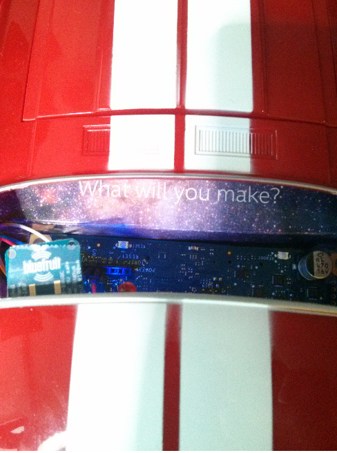

Windows on Devices - Windows Phone Controlled Bluetooth RC Car
===================

---------
**Content**
-------------

- [Components](#Components)
- [Hooking up Components](#hooking-up-components)
- [Run it!](#run-it!)
- [The Code](#the-code)
- [Other Resources](#other-resources)

###**Components**

#### 1. Everything you needed to create the [USB controlled RC Car](http://www.github.com/ms-iot/sample-rccar)
    1a. Upgrade to an Intel Galileo V2 and you can run the whole RC car off of a standard 9.6V RC Battery pack!

#### 2. An [Adafruit EZ-Link](http://www.adafruit.com/product/1588) Bluetooth Breakout Board

#### 3. A Developer Unlocked Nokia Lumia 520 (or other Windows Phone 8.1 device)

###**Hooking up Components**

First, wire up the RC Car and motor driver board as discussed in an earlier project, available here: [USB Controlled RC Car](https://github.com/ms-iot/sample-rccar#hooking-up-components).

Secondly, wire up the Adafruit EZBluetooth device as described below:
    1. Vin to 3.3V up to 16V
    2. GND to Ground
    3. TX on the EZ-Link to RX on the Galileo
    4. RX on the EZ-Link to TX on the Galileo

Let's also wire up an LED so we have an indication of when the RC car is fully booted and ready to go. Wire up the positive lead of the LED to pin 2 on the Galileo, and the negative lead through a 220Ohm resistor to Ground.

###**Run it!**

First, build the Windows Phone Application and the Windows on Devices RC Car Application. 

Make sure the Galileo on the RC Car is booted and connected to your computer over a network. Deploy the RC Car application to the car. Make note of the folder you have deployed the application to. 

In Windows Explorer, navigate to //[GALILEOHOSTNAME OR IP]/c$, when prompted, log in using the credentials 

you've set up on your Galileo. Then, navigate to //[GALILEOHOSTNAME OR IP>]/c$/Windows/system32/Boot and edit autorun.cmd with any text editor. Add the line "start [RCCAREXECUTABLE]" with the correct path for where you deployed your RC Car application. This will cause this application to automatically launch when the RC Car is turned on.

Next, shutdown and restart the RC Car. When the red light turns on, the car can accept bluetooth commands.

Deploy the Windows Phone companion application to your phone. When the RC Car is ready, hit the connect button in the application (make sure Bluetooth is turned on, and you're paired with the Adafruit Bluetooth device. For instructions, see Adafruit's  documentation [here](https://learn.adafruit.com/introducing-bluefruit-ez-link/overview), but basically you just pair with it and then press the little button on the breakout board to confirm). Make sure that the correct device name is entered in the textbox before hitting connect.

Assuming the connection was successful, you will see the status box change to "Connected". You can now drive the car by tilting the phone in different directions!

###**The Code**

All of the Car logic is available in Main.cpp of the RC Car Application. Using the Adafruit Bluetooth breakout board is as simple as using the Arduino Hardware Serial APIs. 

The Windows Phone logic is available in Main.xaml.cs of the phone application project. For a fuller resource of how to use Bluetooth in Windows Phone 8, see the resource available on [Nokia's Developer Wiki](http://developer.nokia.com/community/wiki/Windows_Phone_8_communicating_with_Arduino_using_Bluetooth) ConnectionManager.cs holds the logic to communicate with Bluetooth.

You can see we've just structured the commands to the robot as simple strings, which we read and convert into appropriate action in the Galileo application.

###**Other Resources**

[USB Controlled Windows RC Car](http://github.com/ms-iot/sampple-rccar)

[Adafruit EZ-Link Bluetooth Serial Tutorial](https://learn.adafruit.com/introducing-bluefruit-ez-link/overview)

[Nokia's Developer Wiki: Communicating with an Arduino over Bluetooth](http://developer.nokia.com/community/wiki/Windows_Phone_8_communicating_with_Arduino_using_Bluetooth)